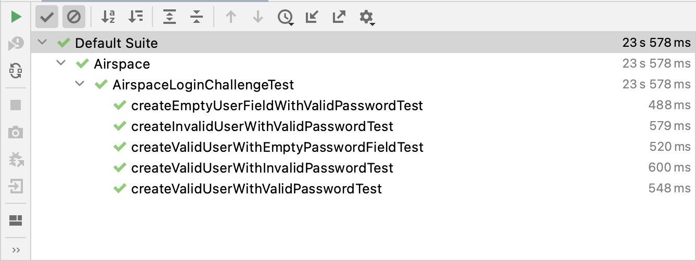

## README

This test suite tests the login page: 
https://the-internet.herokuapp.com/login

### Prerequisites

This project requires `java` and `mvn` (Maven) tools to execute tests.
Also, the tests can be run directly from IntelliJ IDEA IDE.

### Execution

To execute tests from a command line, run
```
mvn clean test
```
To execute tests from IntelliJ IDEA, import the project and clicking `Run` on the test class.

## Results

After the execution, all tests should pass
